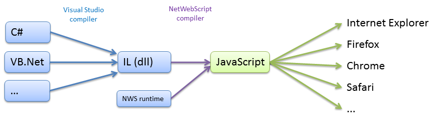

# Project Summary
NetWebScript is an IL to JavaScript compiler. It allows to write complex web application in C# or any other .Net language. It provides Visual Studio integration to debug into orginial sources. It allows to share code with server.

# Key features

* Transform any .Net language code into cross-browser JavaScript
	* All languages features can be supported (generics, delegates, lambdas, linq)
	* Support of standard .Net classes and libraries (partial a this time)
	* Access to JavaScript specific objects (comes with server side implementation)
	* Code that works both on server and in the browser
* Take avantage of all great .Net developpement tools for you browser side applications
	* IntelliSense
	* Refactoring, References analysis
	* Build time errors
	* Documentation generation
	* Code Contracts, FxCop
	* etc.
* Debug your application in Visual Studio in the orginal code
	* Run your application in any browser, add a break point in Visual Studio
	* Browse effective objects
* Make Unit Test using Visual Studio (or nunit)
	* Run your tests in many browsers at once, and get the result in Visual Studio
* Seamless remoting between browser and client (using XHR)
	* Simply mark a method to run on server, serialization and request are done automaticly

# Presentation

* [How it works](How-it-works)
* [Documentation](Documentation)

* [Acknowledgements](Acknowledgements)
