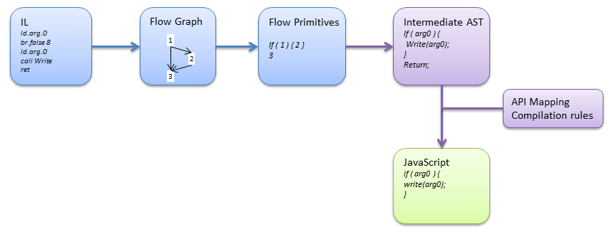

# How it works

## IL to JavaScript

## API

## Debugger

In "Debug" mode, generated JavaScript is instrumented using "pdb" informations and use XmlHttpRequest to contact a debug server hosted by Visual Studio. All metadata informations are stored into an xml file.

In "Realease" mode, generated JavaScript contains, of course, absolutlty no instrumentation. Anyway, some metadata are stored in the associated xml file. This file is not used by browser side runtime, but by server side remoting features (AJAX remoting). It can be also used to map generated identifiers to original code names.

