# "Calculator application" Tutorial 

## Prerequisites

Before starting tutorial, ensures that you have :
* Visual Studio 2010 Professional or better
* NetWebScript 0.1 (download from "Downloads" tab)

## Objectives

The tutorial goal is to build a simple calculator application.

This tutorial gives an overview on how to build a web application using NetWebScript.

Key objectives :
* Write C# code that can run into a web browser
* Debug code running in a web browser with Visual Studio 2010
* Use browser natives objects, and JQuery, in C#

## Part 1 : Create a NetWebScript Web Application
_Say "hello world"_

Start Visual Studio 2010. And then create a new project.

In the "New project" window, select "Visual C#", and then "Web". In the list click on "NetWebScript Web Application".

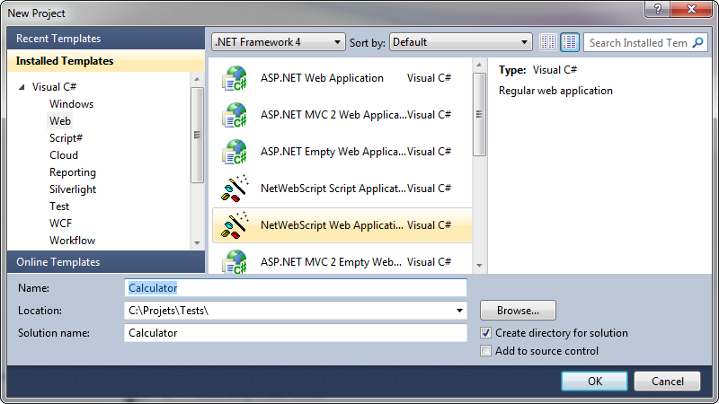

Project template includes one html page and a corresponding C# class.

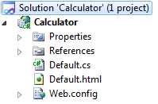

Compile project using "F6" key. Then display all files in project explorer.

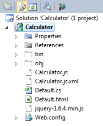

NetWebScript has generated a JavaScript file. This file is already referenced in the "Default.html" page.

Open "Default.cs", and change the class code to
{code:c#}
    [ScriptAvailable, Exported(IgnoreNamespace = true)](ScriptAvailable,-Exported(IgnoreNamespace-=-true))
    public class Default
    {
        public static void OnLoad()
        {
            Window.Alert("Hello world !");
        }
    }
{code:c#}

Then open "Default.html", and change html body to 
{code:html}
<body>

</body>
{code:html}

Compile project (using "F6" key), and launch project (using "F5" key). A message box should appear.
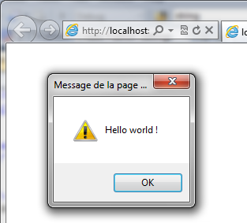

Let's test debugger.

Add a break on the "Window.Alert" line. Then refresh browser page (if it does not work the first time, it might be because the debugger has not yet propagated the information up to the browser, simply retry after few seconds).

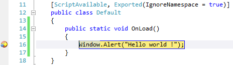

Then hit "F5" to continue. Message box will then appear in web browser.

Remove breakpoint to continue.

## Part 2 : Use JQuery to connect to HTML elements
_JQuery is still your friend_

The calculator GUI is entirely build using HTML and CSS. 

In the head section, add
{code:html}
    
{code:html}

In the body section, before the "OnLoad" call, add 
{code:html}
    <table>
        <tr>
            <td colspan="5" class="disp">
                &nbsp;
            </td>
        </tr>
        <tr>
            <td colspan="5" class="disp">
                &nbsp;0
            </td>
        </tr>
        <tr>
            <td>
                <button class="num">7</button>
            </td>
            <td>
                <button class="num">8</button>
            </td>
            <td>
                <button class="num">9</button>
            </td>
            <td>
                <button class="op">/</button>
            </td>
            <td>
                <button id="c">C</button>
            </td>
        </tr>
        <tr>
            <td>
                <button class="num">4</button>
            </td>
            <td>
                <button class="num">5</button>
            </td>
            <td>
                <button class="num">6</button>
            </td>
            <td>
                <button class="op">*</button>
            </td>
            <td>
                <button id="ce">CE</button>
            </td>
        </tr>
        <tr>
            <td>
                <button class="num">1</button>
            </td>
            <td>
                <button class="num">2</button>
            </td>
            <td>
                <button class="num">3</button>
            </td>
            <td>
                <button class="op">-</button>
            </td>
            <td rowspan="2">
                <button id="eq">=</button>
            </td>
        </tr>
        <tr>
            <td colspan="2">
                <button class="num">0</button>
            </td>
            <td>
                <button id="dec">.</button>
            </td>
            <td>
                <button class="op">+</button>
            </td>
        </tr>
    </table>
{code:html}

Launch application to check result in web browser.

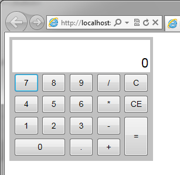

To handle events from htmls elements, we have to connect our code to them. Like in plain JavaScript, JQuery is the best way to achieve this. Full JQuery API is available in NetWebScript, including IntelliSense documentation. 

The JQuery function is available as {{JQuery.Query}}.

In the "OnLoad" method, call JQuery to attach to "click" event of numbers buttons (CSS class "num"), and display their number in a message box.

{code:c#}
        public static void OnLoad()
        {
            JQuery.Query(".num").Bind("click", e =>
            {
                Window.Alert(JQuery.Query(e.CurrentTarget).Text());
                return true;
            });
        }
{code:c#}

Launch application to test your code in the browser. Click on a number button.

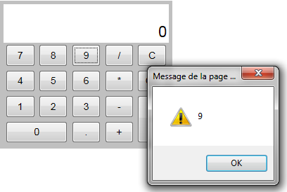

Up to now, we have only used methods and objects from browser. Now let's implement the calculator and use some .Net objects.

## Part 3 : Number input
_"Hello world" was too easy_

We have a span that is intended to display current number (with id="value"). Our goal is to concatenate digits to that that number.

We will keep a reference to this object in an instance field.

First, create an instance method with initialization logic.
{code:c#}
        private void Initialize()
        {
            JQuery.Query(".num").Bind("click", e =>
            {
                Window.Alert(JQuery.Query(e.CurrentTarget).Text());
                return true;
            });
        }

        public static void OnLoad()
        {
            Default instance = new Default();
            instance.Initialize();
        }
{code:c#}

In that method, find the value span using JQuery, and store the JQuery object in an instance field.
{code:c#}
        private JQuery valueDisplay;

        private void Initialize()
        {
            valueDisplay = JQuery.Query("#value");
            // ...
        }
{code:c#}

Create a method "Append" to append the digit. The first digit should clear the value, so add a boolean instance field with initial value set to true.

{code:c#}
        private bool nextCharClearAll = true;

        private void Append(string charText)
        {
            string currentText;
            if (nextCharClearAll)
            {
                currentText = charText;
                nextCharClearAll = false;
            }
            else
            {
                currentText = valueDisplay.Text();
                currentText = currentText + charText;
            }
            valueDisplay.Text(currentText);
        }
{code:c#}

Then, replace the Window.Alert call by the Append method.

{code:c#}
            JQuery.Query(".num").Bind("click", e =>
            {
                Append(JQuery.Query(e.CurrentTarget).Text());
                return true;
            });
{code:c#}

Launch application, and test in browser.

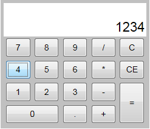

Add a break point on the {{currentText = currentText + charText;}} line. 
Click on a digit button in the web browser.

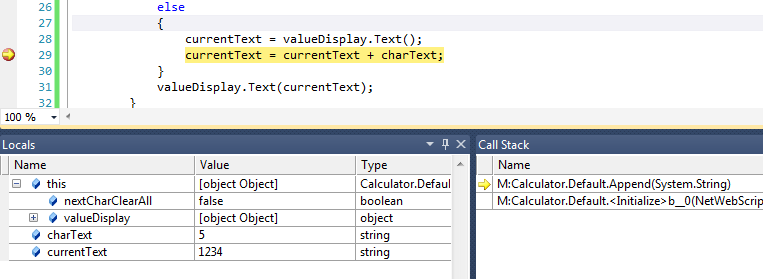

Locals and stack trace are availables. Step over using F10 key.

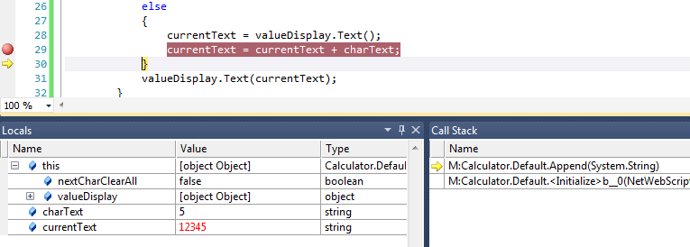

**It simply works :o)**. Hit F5 key to continue. Remove break point.

Now, we would like to implement the decimal separator button.

First, change the button text with the local culture decimal separator, in the Initialize method.

{code:c#}
            JQuery.Query("#dec").Text(NumberFormatInfo.CurrentInfo.NumberDecimalSeparator)
{code:c#}

**Note:** Version 0.1 of NetWebScript includes only the neutral culture, next versions will includes almost all cultures. In current version, the previous piece of code will always set decimal separator to ".", but is ready for future releases.

Then add a method to concatenate the decimal separator, if it is not yet in the input, don't forget to test "nextCharClearAll".

{code:c#}
        private void DecimalSep()
        {
            string currentText;
            if (nextCharClearAll)
            {
                currentText = "0" + NumberFormatInfo.CurrentInfo.NumberDecimalSeparator;
                nextCharClearAll = false;
            }
            else
            {
                currentText = valueDisplay.Text();
                if (!currentText.Contains(NumberFormatInfo.CurrentInfo.NumberDecimalSeparator))
                {
                    currentText = currentText + NumberFormatInfo.CurrentInfo.NumberDecimalSeparator;
                }
            }
            valueDisplay.Text(currentText);
        }
{code:c#}

Finally connect the method to the "click" event of the decimal separator button. You can reuse the JQuery call.

{code:c#}
            JQuery.Query("#dec").Text(NumberFormatInfo.CurrentInfo.NumberDecimalSeparator).Bind("click", e =>
            {
                DecimalSep();
                return true;
            });
{code:c#}

Launch application, and test in browser.

## Part 4 : Operators and special buttons
_Who need a calculator ?_

When an operator button is clicked, two scenarios are possible: 
* Case 1 : There is no pending operation, only a number was input by the user
* Case 2 : There is a pending operation

In the first case, we have to memorize the operation and make it "pending", the user input becomes the "intermediate" result.
In the second case, we have to apply the pending operation using user input and previous "intermediate" result. The result of the operation is the new "intermediate" operation.

We would like to display pending operations. The GUI has a span for this purpose (id="pending").

You may try by yourself, or you can simply follow the proposed implementation.
**Be carefull**, current NetWebScript version supports a really small subset of .Net APIs. 

Expected result: 

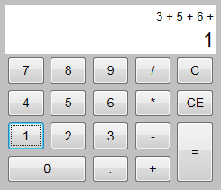 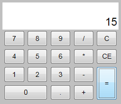

Proposed implementation :

{code:c#}
        private string pendingOperator;
        private double intermediate;

        private double Compute()
        {
            var current = double.Parse(valueDisplay.Text(), NumberFormatInfo.CurrentInfo);
            if (pendingOperator != null)
            {
                switch (pendingOperator)
                {
                    case "+": return intermediate + current;
                    case "-": return intermediate - current;
                    case "/": return intermediate / current;
                    case "**": return intermediate ** current;
                }
            }
            return current;
        }

        private void Operator(string charText)
        {
            intermediate = Compute();
            nextCharClearAll = true;
            pendingOperator = charText;
        }
{code:c#}

Let's implement pending operation display.

Like the valueDisplay, add an instance field to store the corresponding JQuery object.

{code:c#}
        private JQuery pendingDisplay;

        private void Operator(string charText)
        {
            bool hasPending = pendingOperator != null;

            intermediate = Compute();
            nextCharClearAll = true;
            pendingOperator = charText;

            if (!hasPending)
            {
                pendingDisplay.Text(valueDisplay.Text() + " " + charText);
            }
            else
            {
                pendingDisplay.Text(pendingDisplay.Text() + " " + valueDisplay.Text() + " " + charText);
            }
        }
{code:c#}

In method "Initialize", connect our method to the operators buttons (CSS class "op"), and get the pending display element.

{code:c#}
            pendingDisplay = JQuery.Query("#pending");
            JQuery.Query(".op").Bind("click", e =>
            {
                Operator(JQuery.Query(e.CurrentTarget).Text());
                return true;
            });
{code:c#}

To be able to test we need to implement the "equal" button. Like an opeartor, it executes pending operation. But it clears current state.

{code:c#}
        private void Equal()
        {
            var result = Compute();
            nextCharClearAll = true;
            pendingOperator = null;
            pendingDisplay.Text("");
            valueDisplay.Text(result.ToString(NumberFormatInfo.CurrentInfo));
        }
{code:c#}

In method "Initialize", connect previous method to the equal button.

{code:c#}
            JQuery.Query("#eq").Bind("click", e =>
            {
                Equal();
                return true;
            });
{code:c#}

Start the application, and do some tests.

To finish calculator implementation, we need to implement the "C" and "CE" buttons.
* "C" clear everything (pending operation and input)
* "CE" clear only the current input

{code:c#}
        private void Clear()
        {
            nextCharClearAll = true;
            pendingOperator = null;
            pendingDisplay.Text("");
            valueDisplay.Text("0");
        }

        private void ClearCurrent()
        {
            nextCharClearAll = true;
            valueDisplay.Text("0");
        }
{code:c#}

In the "Initialize" method, connect the methods.

{code:c#}
            JQuery.Query("#c").Bind("click", e =>
            {
                Clear();
                return true;
            });
            JQuery.Query("#ce").Bind("click", e =>
            {
                ClearCurrent();
                return true;
            });
{code:c#}

## Part 5 : Behind the scenes

